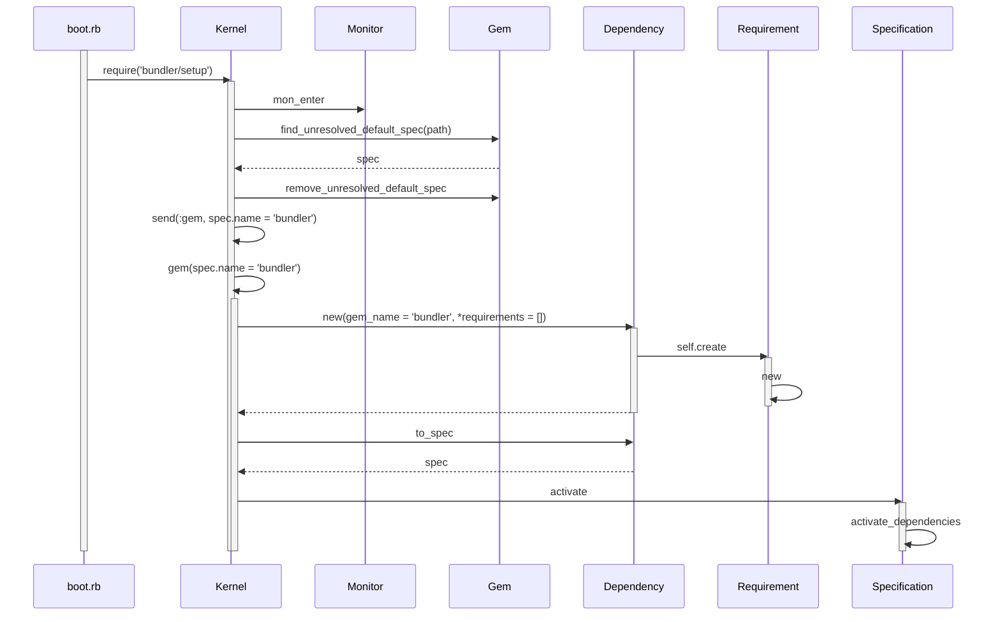

# require 'bundler/setup' #

```console
% ruby -v
ruby 2.6.10p210 (2022-04-12 revision 67958) [arm64-darwin21]
```


```mermaid
sequenceDiagram
  participant boot.rb
  activate boot.rb
    boot.rb->>Kernel: require('bundler/setup')
    activate Kernel
      Kernel->>Monitor: mon_enter
      Kernel->>Gem: find_unresolved_default_spec(path)
      Gem-->>Kernel: spec
      Kernel->>Gem: remove_unresolved_default_spec
      Kernel->>Kernel: send(:gem, spec.name = 'bundler')
      Kernel->>Kernel: gem(spec.name = 'bundler')
      activate Kernel
        Kernel->>Dependency: new(gem_name = 'bundler', *requirements = [])
        activate Dependency
          Dependency->>Requirement: self.create
          activate Requirement
            Requirement->>Requirement: new
          deactivate Requirement
          Dependency-->>Kernel: 
        deactivate Dependency
        Kernel->>Dependency: to_spec
        Dependency-->>Kernel: spec
        Kernel->>Specification: activate
        activate Specification
          Specification->>Specification: activate_dependencies
        deactivate Specification
      deactivate Kernel
    deactivate Kernel
  deactivate boot.rb
```
