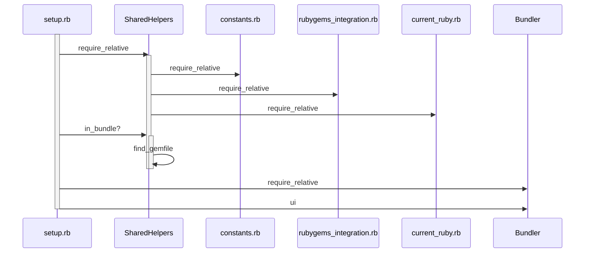

# bundler/setup #

How `require 'bundler/setup'` are carried out?

```console
% bundle -v
Bundler version 2.1.4
```


```mermaid
sequenceDiagram
  participant setup.rb
  activate setup.rb
    setup.rb->>SharedHelpers: require_relative
    activate SharedHelpers
      SharedHelpers->>constants.rb: require_relative
      SharedHelpers->>rubygems_integration.rb: require_relative
      SharedHelpers->>current_ruby.rb: require_relative
      setup.rb->>SharedHelpers: in_bundle?
      activate SharedHelpers
        SharedHelpers->>SharedHelpers: find_gemfile
      deactivate SharedHelpers
    deactivate SharedHelpers
    setup.rb->>Bundler: require_relative
    setup.rb->>Bundler: ui
  deactivate setup.rb

```
