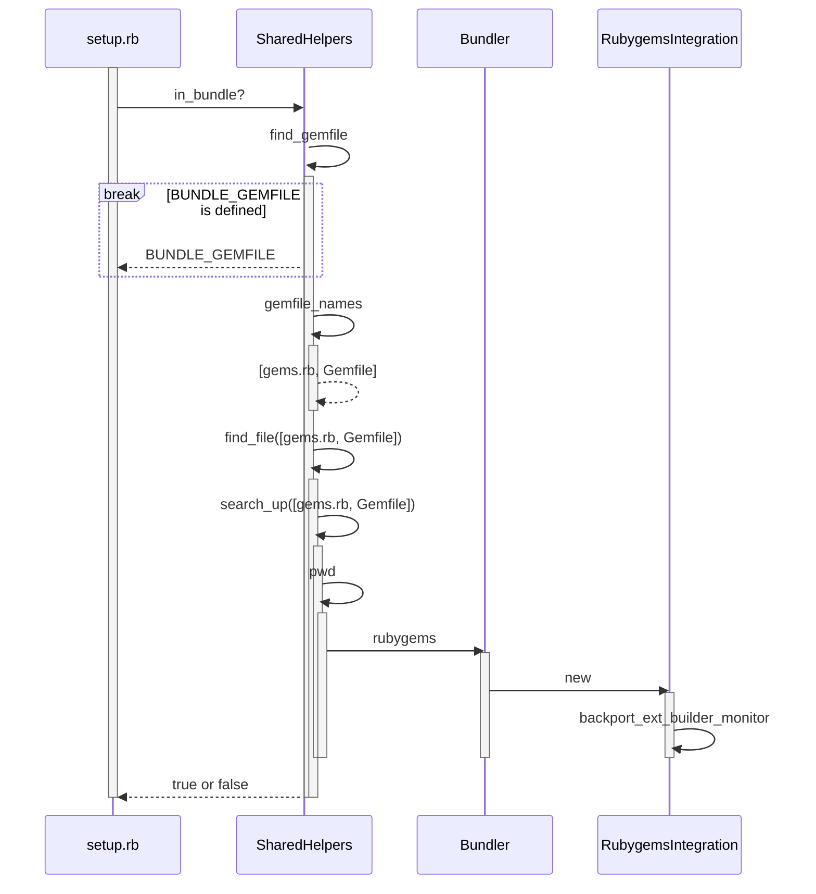

# setup.rb ###

```mermaid
sequenceDiagram
  participant setup.rb
  participant SharedHelpers
  activate setup.rb
    setup.rb->>SharedHelpers: in_bundle?
    activate SharedHelpers
      SharedHelpers->>SharedHelpers: find_gemfile
      activate SharedHelpers
        break BUNDLE_GEMFILE is defined
          SharedHelpers-->>setup.rb: BUNDLE_GEMFILE
        end
        SharedHelpers->>+SharedHelpers: gemfile_names
        SharedHelpers-->>-SharedHelpers: [gems.rb, Gemfile]
        SharedHelpers->>+SharedHelpers: find_file([gems.rb, Gemfile])
        SharedHelpers->>SharedHelpers: search_up([gems.rb, Gemfile])
        activate SharedHelpers
          SharedHelpers->>SharedHelpers: pwd
          activate SharedHelpers
            SharedHelpers->>Bundler: rubygems
            activate Bundler
              Bundler->>RubygemsIntegration: new
              activate RubygemsIntegration
                RubygemsIntegration->>RubygemsIntegration: backport_ext_builder_monitor
              deactivate RubygemsIntegration
            deactivate Bundler
          deactivate SharedHelpers
        deactivate SharedHelpers
        SharedHelpers-->>setup.rb: true or false
      deactivate SharedHelpers
    deactivate SharedHelpers
  deactivate setup.rb
```
