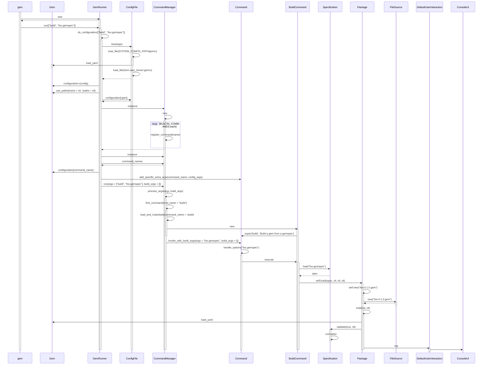

# gem build foo.gemspec #

```console
% gem -v
3.0.3.1
```


```mermaid
sequenceDiagram
  participant gem
  participant Gem
  participant GemRunner
  activate gem
    gem->>GemRunner: new

    activate GemRunner

      GemRunner-->>gem: 
      gem->>GemRunner: run(["build", "foo.gemspec"])
      activate GemRunner
        GemRunner->>GemRunner: do_configuration(["build", "foo.gemspec"])
        activate GemRunner
          GemRunner->>ConfigFile: new(args)

          activate ConfigFile

            ConfigFile->>ConfigFile: load_file(SYSTEM_CONFIG_PATH/gemrc)
            activate ConfigFile
              ConfigFile->>Gem: load_yaml
              activate Gem
              deactivate Gem
            deactivate ConfigFile
            ConfigFile->>ConfigFile: load_file(Gem.user_home/.gemrc)
            ConfigFile-->>GemRunner: 
            GemRunner->>Gem: configuration=(config)
            GemRunner->>Gem: use_paths(home = nil, *paths = nil)
            GemRunner->>ConfigFile: configuration[:gem]
            ConfigFile-->>GemRunner: 
        deactivate GemRunner
        GemRunner->>CommandManager: instance
        CommandManager->>CommandManager: new

          activate CommandManager

            loop BUILTIN_COMMANDS.each
              CommandManager->>CommandManager: register_command(name)
            end
            CommandManager-->>GemRunner: 

      GemRunner->>CommandManager: instance
        GemRunner->>CommandManager: command_names
        CommandManager-->>GemRunner: 
        GemRunner->>Gem: configuration[command_name]
        GemRunner->>Command: add_specific_extra_args(command_name, config_args)
        GemRunner->>CommandManager: run(args = ["build", "foo.gemspec"], build_args = [])
        CommandManager->>CommandManager: process_args(args, build_args)
        activate CommandManager
          CommandManager->>CommandManager: find_command(cmd_name = "build")
          activate CommandManager
            CommandManager->>CommandManager: load_and_instantiate(command_name = :build)
            CommandManager->>BuildCommand: new

            activate BuildCommand

              BuildCommand->>Command: super('build', 'Build a gem from a gemspec')
          deactivate CommandManager
          CommandManager->>Command: invoke_with_build_args(args = "foo.gemspec", build_args = [])
          Command->>Command: handle_options("foo.gemspec")
          activate Command
            Command->>BuildCommand: execute
            activate BuildCommand
              BuildCommand->>Specification: load("foo.gemspec")
              Specification-->>BuildCommand: spec
              BuildCommand->>Package: self.build(spec, nil, nil, nil)
              activate Package
                Package->>Package: self.new("foo-0.1.0.gem")
                activate Package
                  Package->>FileSource: new("foo-0.1.0.gem")
                  activate FileSource
                    FileSource-->>Package: 
                  deactivate FileSource
                deactivate Package
                Package->>Package: build(nil, nil)
                activate Package
                  Package->>Gem: load_yaml
                  Package->>Specification: validate(true, nil)
                  activate Specification
                    Specification->>Specification: normalize
                  deactivate Specification
                  Package->>DefaultUserInteraction: say
                  activate DefaultUserInteraction
                    DefaultUserInteraction->>ConsoleUI: 
                  deactivate DefaultUserInteraction
                deactivate Package
              deactivate Package
            deactivate BuildCommand
          deactivate Command

            deactivate BuildCommand

        deactivate CommandManager

          deactivate CommandManager

          deactivate ConfigFile

      deactivate GemRunner

    deactivate GemRunner
  deactivate gem
```
