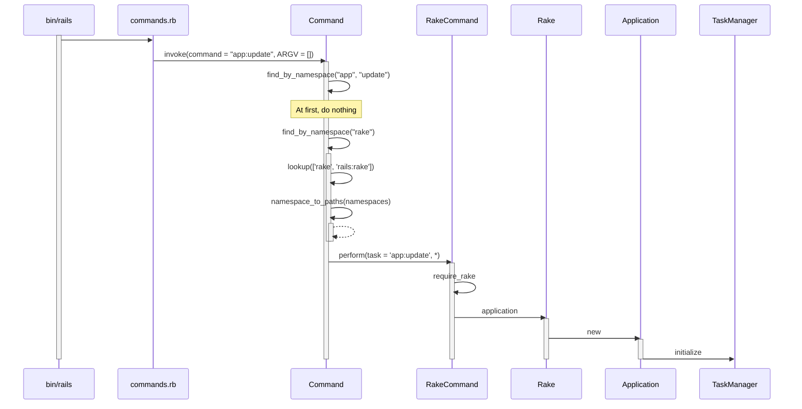

# rails app:update #

This is how `rails app:update` works:

```console
% ruby -v
ruby 2.6.10p210 (2022-04-12 revision 67958) [arm64-darwin21]
% rails app:update
```

## bin/rails ##

```sh
#!/usr/bin/env ruby
APP_PATH = File.expand_path('../config/application', __dir__)
require_relative '../config/boot'
require 'rails/commands'
```

## require 'rails/commands' ##


