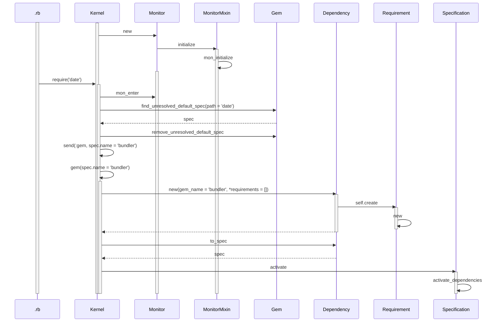

# require 'date' #

This is how `require 'date'` works:

```console
% ruby -v
ruby 2.6.10p210 (2022-04-12 revision 67958) [arm64-darwin21]
% ruby -e 'puts Gem::VERSION'
3.0.3.1
```


```mermaid
sequenceDiagram
  participant .rb
  activate .rb
    activate Kernel
      Kernel->>Monitor: new
      Monitor->>MonitorMixin: initialize
      activate MonitorMixin
        MonitorMixin->>MonitorMixin: mon_initialize
        activate Monitor
          .rb->>Kernel: require('date')
          activate Kernel
            Kernel->>Monitor: mon_enter
            Kernel->>Gem: find_unresolved_default_spec(path = 'date')
            Gem-->>Kernel: spec
            Kernel->>Gem: remove_unresolved_default_spec
            Kernel->>Kernel: send(:gem, spec.name = 'bundler')
            Kernel->>Kernel: gem(spec.name = 'bundler')
            activate Kernel
              Kernel->>Dependency: new(gem_name = 'bundler', *requirements = [])
              activate Dependency
                Dependency->>Requirement: self.create
                activate Requirement
                  Requirement->>Requirement: new
                deactivate Requirement
                Dependency-->>Kernel: 
              deactivate Dependency
              Kernel->>Dependency: to_spec
              Dependency-->>Kernel: spec
              Kernel->>Specification: activate
              activate Specification
                Specification->>Specification: activate_dependencies
              deactivate Specification
            deactivate Kernel
          deactivate Kernel
        deactivate Monitor
      deactivate MonitorMixin
    deactivate Kernel
  deactivate .rb
```
